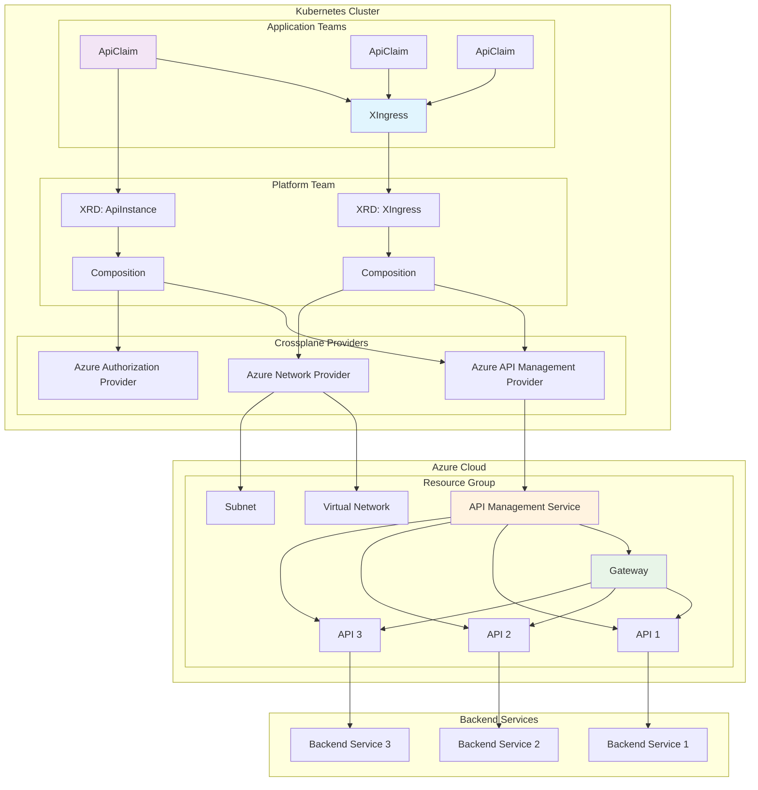

# Crossplane Azure Infrastructure Platform

A Crossplane-based infrastructure platform for managing Azure API Management gateways and APIs through composable resources.

## What is Crossplane?

[Crossplane](https://crossplane.io/) is a Cloud Native Computing Foundation (CNCF) project that transforms your Kubernetes cluster into a universal control plane. It enables platform teams to assemble infrastructure from multiple vendors, and expose higher level self-service APIs for application teams to consume.

**Learn More:**
- 📖 [Crossplane Documentation](https://docs.crossplane.io/)
- 🚀 [Getting Started Guide](https://docs.crossplane.io/latest/getting-started/)
- 🎯 [Crossplane Concepts](https://docs.crossplane.io/latest/concepts/)
- 💡 [Composition Guide](https://docs.crossplane.io/latest/concepts/compositions/)

## Architecture Diagram



## Overview

This project provides a set of Crossplane Composite Resource Definitions (XRDs) and Compositions that enable platform teams to provision and manage Azure API Management infrastructure declaratively. The platform abstracts complex Azure resources into simple, reusable components.

### Why Crossplane?

✅ **Declarative Infrastructure**: Define infrastructure using Kubernetes-native YAML  
✅ **GitOps Ready**: Version control your infrastructure alongside your applications  
✅ **Self-Service**: Enable development teams to provision infrastructure safely  
✅ **Consistent APIs**: Standardize infrastructure provisioning across teams  
✅ **Policy & Governance**: Implement organizational policies and compliance  
✅ **Multi-Cloud**: Extend to other cloud providers using the same patterns  

### Platform Benefits

- **Reduced Complexity**: Abstract away Azure-specific details from development teams
- **Faster Onboarding**: Teams can provision API gateways in minutes, not hours
- **Cost Optimization**: Share expensive resources like API Management services
- **Operational Excellence**: Standardized configurations reduce operational overhead
- **Security by Default**: Embed security best practices into platform abstractions

## Architecture

### Core Components

1. **XIngress** - Manages the shared API gateway infrastructure
2. **ApiInstance/ApiClaim** - Manages individual APIs within the gateway
3. **Crossplane Providers** - Azure resource providers for various services

### Resource Hierarchy

```
XIngress (Shared Gateway)
├── Azure Resource Group
├── Virtual Network
├── Subnet
├── API Management Service
└── API Management Gateway
    └── ApiClaim (Individual APIs)
        ├── API
        └── Gateway API Association
```

## Quick Start

### Prerequisites

- Kubernetes cluster (v1.24+) with Crossplane installed
- Azure subscription with appropriate permissions
- Azure Service Principal with custom role permissions

### Installation

```bash
# 1. Install Crossplane providers
kubectl apply -f crossplane-provider/

# 2. Configure Azure credentials
kubectl create secret generic azure-secret \
  --from-literal=creds='{"clientId":"<client-id>","clientSecret":"<client-secret>","subscriptionId":"<subscription-id>","tenantId":"<tenant-id>"}' \
  --namespace crossplane-system

# 3. Deploy compositions and XRDs
kubectl apply -f compositions/

# 4. Create your first gateway
kubectl apply -f examples/example-xingress.yaml
```

### Basic Usage

Create a shared API gateway:

```yaml
apiVersion: azure.platform.my-org.co/v1alpha1
kind: XIngress
metadata:
  name: my-gateway
spec:
  name: my-gateway
  location: UK
  apiManagement:
    publisherEmail: devops@my-org.co
    publisherName: DevOps Team
    skuName: Developer_1
```

Add an API to the gateway:

```yaml
apiVersion: platform.my-org.co/v1alpha1
kind: ApiClaim
metadata:
  name: my-api
spec:
  ingressRef: my-gateway
  apiName: "My API"
  apiPath: "myapi"
  backendUrl: "https://my-backend.azurewebsites.net/api"
  swaggerDefinition: |
    openapi: 3.0.0
    info:
      title: My API
      version: 1.0.0
    paths:
      /health:
        get:
          responses:
            '200':
              description: OK
```

## Documentation

### Core Documentation

- **[Installation Guide](docs/INSTALLATION.md)** - Step-by-step installation instructions
- **[Configuration Reference](docs/CONFIGURATION.md)** - Complete configuration options
- **[API Reference](docs/API_REFERENCE.md)** - Detailed API specifications
- **[Troubleshooting Guide](docs/TROUBLESHOOTING.md)** - Common issues and solutions

### Requirements

- **[System Requirements](docs/REQUIREMENTS.md)** - Infrastructure and permission requirements
- **[Azure Role Definition](crossplane-role-definition.json)** - Custom Azure role permissions

### Examples

- **[Example XIngress](examples/example-xingress.yaml)** - Complete gateway example
- **[Example ApiClaim](examples/example-api-claim.yaml)** - Complete API example
- **[ApiClaim Usage Guide](examples/api-claim-README.md)** - Detailed ApiClaim documentation

## Project Structure

```
.
├── README.md                           # This file
├── docs/                              # Documentation
│   ├── INSTALLATION.md                # Installation guide
│   ├── CONFIGURATION.md               # Configuration reference
│   ├── API_REFERENCE.md               # API specifications
│   ├── TROUBLESHOOTING.md             # Troubleshooting guide
│   └── REQUIREMENTS.md                # System requirements
├── crossplane-role-definition.json    # Azure RBAC role definition
├── crossplane-provider/               # Crossplane provider configurations
│   ├── provider-azure-*.yaml         # Azure provider definitions
│   ├── providerconfig-azure.yaml     # Provider configuration
│   └── function-patch-and-transform.yaml
├── compositions/                      # Crossplane compositions
│   ├── xingress/                     # Shared gateway composition
│   │   ├── xingress-definition.yaml  # XIngress XRD
│   │   └── xingress-composition.yaml # XIngress Composition
│   └── xapi/                         # API composition
│       ├── xapi-definition.yaml      # ApiInstance XRD
│       └── xapi-composition.yaml     # ApiInstance Composition
└── examples/                        # Example resources
    ├── example-xingress.yaml         # Example XIngress
    ├── example-api-claim.yaml        # Example ApiClaim
    └── api-claim-README.md           # ApiClaim usage guide
```

## Key Features

### Shared Gateway Infrastructure

- **Single Gateway, Multiple APIs**: One XIngress supports multiple ApiClaims
- **Cost Optimization**: Shared infrastructure reduces Azure costs
- **Centralized Management**: Single point of configuration for gateway settings

### Declarative API Management

- **GitOps Ready**: All configurations stored as YAML
- **Version Control**: Track changes to API definitions
- **Automated Deployment**: Kubernetes-native resource management

### Multi-Region Support

- **UK Region**: UK South Azure region
- **US East Region**: East US Azure region
- **Extensible**: Easy to add new regions

### Flexible SKU Options

- **Development**: Developer_1 SKU for testing
- **Production**: Standard_1 and Premium_1 SKUs
- **Cost-Effective**: Consumption SKU for variable workloads

## Supported Azure Resources

### Core Resources

- **Resource Groups**: Container for related resources
- **Virtual Networks**: Network isolation and segmentation
- **Subnets**: Network subdivision for services
- **API Management Services**: Core API gateway functionality

### Optional Resources

- **CDN Profiles**: Global content delivery
- **DNS Zones**: Custom domain management
- **Storage Accounts**: Additional storage needs

## Configuration Examples

### Development Environment

```yaml
apiVersion: azure.platform.my-org.co/v1alpha1
kind: XIngress
metadata:
  name: dev-gateway
spec:
  name: dev-gateway
  location: UK
  apiManagement:
    skuName: Developer_1
  networking:
    vnetAddressSpace: ["10.0.0.0/24"]
    subnetPrefix: ["10.0.0.0/26"]
```

### Production Environment

```yaml
apiVersion: azure.platform.my-org.co/v1alpha1
kind: XIngress
metadata:
  name: prod-gateway
spec:
  name: prod-gateway
  location: UK
  apiManagement:
    skuName: Standard_1
  networking:
    vnetAddressSpace: ["10.0.0.0/16"]
    subnetPrefix: ["10.0.1.0/24", "10.0.2.0/24"]
```

## Monitoring and Observability

### Resource Status

```bash
# Check gateway status
kubectl get xingress -o wide

# Check API status
kubectl get apiclaim -o wide

# Check underlying Azure resources
kubectl get managed
```

### Health Checks

```bash
# Verify providers are healthy
kubectl get providers

# Check for any failed resources
kubectl get managed | grep -v True
```

## Security Considerations

### Azure Permissions

- Use least-privilege access for service principals
- Regularly rotate service principal credentials
- Monitor service principal usage

### Network Security

- Implement proper network security groups
- Use private endpoints where possible
- Restrict API Management access as needed

### API Security

- Implement authentication and authorization
- Use API policies for security controls
- Monitor API usage patterns

## Cost Optimization

### SKU Selection

- Use Developer_1 for development environments
- Use Consumption for variable workloads
- Use Standard_1 or Premium_1 for production

### Resource Sharing

- Share XIngress across multiple teams
- Use ApiClaims for individual API management
- Implement proper resource tagging

## Contributing

### Development Setup

1. Fork the repository
2. Create a feature branch
3. Make your changes
4. Test in a development environment
5. Submit a pull request

### Guidelines

- Follow existing naming conventions
- Update documentation for new features
- Ensure all required fields are validated
- Test changes thoroughly

## Support and Community

### Getting Help

- Check the [Troubleshooting Guide](docs/TROUBLESHOOTING.md)
- Review the [Configuration Reference](docs/CONFIGURATION.md)
- Consult the [API Reference](docs/API_REFERENCE.md)

### Community Resources

- [Crossplane Community](https://crossplane.io/community)
- [Crossplane Slack](https://slack.crossplane.io)
- [Azure Provider Documentation](https://marketplace.upbound.io/providers/upbound/provider-azure)

## License

This project is licensed under the [Apache 2.0 License](LICENSE).

## Changelog

### Version 1.0.0

- Initial release with XIngress and ApiClaim support
- Multi-region support (UK, US East)
- Comprehensive documentation
- Example configurations

---

**Next Steps**: After installation, see the [Configuration Reference](docs/CONFIGURATION.md) for detailed configuration options and the [API Reference](docs/API_REFERENCE.md) for complete API specifications.
